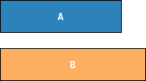
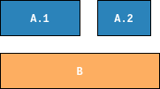

[](https://travis-ci.org/fkie-cad/woodblock)
[](https://codecov.io/gh/fkie-cad/woodblock)
[](https://app.codacy.com/app/0x4d4c/woodblock?utm_source=github.com&utm_medium=referral&utm_content=fkie-cad/woodblock&utm_campaign=Badge_Grade_Settings)

# Woodblock – Easy File Carving Test Data Generation

The goal of Woodblock is to make it as easy as possible to generate file carving test data
sets such as the ones created by the [DFRWS](https://www.dfrws.org/) in their
[2006](http://old.dfrws.org/2006/challenge/) and [2007](http://old.dfrws.org/2007/challenge/)
challenges or by the ones created by
[NIST](https://www.nist.gov/itl/ssd/software-quality-group/computer-forensics-tool-testing-program-cftt/cftt-technical-0).

## Basic Features

*  Simple configuration files based image creation for most use cases.
*  Easy to use Python API for more complex requirements.
*  Ground truth file in JSON format.

## Documentation

See the project’s [GitHub Pages](https://fkie-cad.github.io/woodblock/) for the complete documentation.

## Concepts
Woodblock borrows most concepts from the DFRWS [2006](http://old.dfrws.org/2006/challenge/)
and [2007](http://old.dfrws.org/2006/challenge/) challenges. As stated there,
a **scenario** reflects a “*specific situation that might occur in a real file system*”.
A scenario consists of **files** which are split into **fragments**. Scenarios on the
other hand can be put into an image which can then used as input for the carving tool
you would like to test.

The following example should clarify these concepts. Consider for example the two
**files** `A` and `B`.



These files can be split into **fragments**. In the example, we split file `A` into two
fragments, `A.1` and `A.2`. File `B` has not been fragmented.



If we arrange the fragments of our files, we have a **scenario**:


A scenario can be added to an **image**, which in turn can be written to disk. Or you can
add another scenario to the image as shown below.


Using Woodblock, you could create the images shown above using a simple configuration file:

```ini
[general]
block size = 512
seed = 123
corpus = testfiles

[scenario 1]
frags file1 = 2
frags file2 = 1
layout = 1.1, 2.1, 1.2

[scenario 2]
frags file1 = 3
layout = 1.2, 1.1, Z, 1.3
```

All files possibly added to a scenario have to be stored in a directory. This
directory serves as the test file **corpus** and has to be distributed along
with Woodstock configuration files or scripts using the Woodstock API.