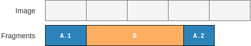
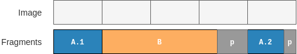

title:      Woodblock API
desc:       Woodblock Python API.
date:       2019/08/22
template:   document
nav:        Usage>API __2__
percent:    95

For most use cases, the [configuration files](configs.md) should suffice.
If you need more fine-grained control over your scenarios you can use the
Python API. For instance, the API lets you define the exact fragmentation
points of your files, exact sizes of filler fragments, and so forth.

Here is a simple script illustrating the basic usage of the API:

```python
#!/usr/bin/env python3
import pathlib
import sys

from woodblock.file import File, draw_files
from woodblock.fragments import RandomDataFragment, ZeroesFragment
from woodblock.image import Image
from woodblock.scenario import Scenario

HERE = pathlib.Path(__file__).absolute().parent


def main():
    woodblock.file.corpus(HERE / '..' / 'data' / 'corpus')
    files = draw_files(number_of_files=2)
    f_a = files[0].fragment_randomly(num_fragments=3)
    f_b = files[1].fragment_evenly(num_fragments=2)

    s = Scenario('First API Scenario')
    s.add(f_a[1])
    s.add(ZeroesFragment(1024))
    s.add(f_b[0])
    s.add(f_a[2])
    s.add(RandomDataFragment(512))
    s.add(f_a[0])
    s.add(f_b[1])

    image = Image(block_size=512)
    image.add(s)
    image.write(HERE / 'api-demo.dd')


if __name__ == '__main__':
    sys.exit(main())
```

This script randomly chooses two files from the file corpus. The first one is
split into three fragments at random fragmentation points, the second one is
split into two fragments of equal size. After that the scenario with the name 
“First API Scenario” is created and the file frgments as well as two filler
fragments are added to the scenario. Finally, the scenario is added to an
image object which is then written to disk.

Let’s go through this example step by step. The first lines are just some
imports.

```python
from woodblock.file import File, draw_files
from woodblock.fragments import RandomDataFragment, ZeroesFragment
from woodblock.image import Image
from woodblock.scenario import Scenario
```

After we define the file corpus and randomly draw two files:

```python
woodblock.file.corpus(HERE / '..' / 'data' / 'corpus')
files = draw_files(number_of_files=2)
```

These files are then split into fragments. The first file is split into three
fragments. The fragmentation points are chosen randomly. The second file is
split into two fragments. The fragmentation point is chosen so that both
fragments are of equal size:

```python
f_a = files[0].fragment_randomly(num_fragments=3)
f_b = files[1].fragment_evenly(num_fragments=2)
```

After that, a `Scenario` object is created. Its argument is the name of the
scenario:

```python
s = Scenario('First API Scenario')
```

A `Scenario` object has a method to `add` fragments to it. A call to `add`
appends a fragment to any previously added fragments, so that the order of the
`add` calls defines the order of the fragments in the scenario:

```python
s.add(f_a[1])
s.add(ZeroesFragment(1024))
s.add(f_b[0])
s.add(f_a[2])
s.add(RandomDataFragment(512))
s.add(f_a[0])
s.add(f_b[1])
```

We did not only added the fragments of our files but also two filler
fragments: a `ZerroesFragment` of 1024 bytes of size and a
`RandomDataFragment` of 512 bytes of size. As you can see, you can specify the
exact size of the filler fragments using the API.

After that, our scenario is complete and we create an `Image` object with a
block size of 512 bytes. `Image` objects represent test image files to be
written to disk. Just like we could add fragments to a scenario, we can add
scenarios to an `Image`. If we added all of the scenarios, we can finally
write the image using the `write` method.

Those are already the basic blocks you need to create your own test images
using the API: you select files from the test file corpus, fragments them
in some way, add the fragments to a scenario, add the scenario to an image,
and finally write the image to disk.

The following sections describe the available API functions and objects in
a more detailed way.

## Files and Fragments
Files are always selected from a file corpus. Therefore, you have to specify
the path to your file corpus before you can select any files. This is done
using the `woodblock.files.corpus` function. This function takes the path to
your file corpus as its only argument. An example call would look like this:

```python
# You can provide the path using a string...
woodblock.file.corpus('path/to/your/corpus/')
# ... or via a pathlib.Path object
path = pathlib.Path('path/to/your/corpus/')
woodblock.file.corpus(path)
```

Once you have defined your corpus, you can start using its files. If you do
not care which exact files to use from your corpus, you can use the
`draw_files` function, which randomly chooses the given number of files from
your corpus. The function lets you not only specify the number of files but
also the minimal size of each files. Moreover, you can specify if duplicate
files are allowed or not. Duplicate files are basically two different objects
pointing to the same original file. Finally, you can indicate that you want
the files to be drawn only from a special subdirectory of your corpus. The
following examples show how to use this function:

```python
# This will give you one randomly chosen file:
single_file = woodblock.file.draw_files()

# Here is an example with four randomly chosen files:
files = woodblock.file.draw_files(number_of_files=4)

# Now we want three files, but only from the jpeg/ subdirectory:
files = woodblock.file.draw_files(path='jpeg', number_of_files=3)

# The same but only files with a minimal size of 2 MB:
files = woodblock.file.draw_files(path='jpeg', number_of_files=3, min_size=2*1024**2)

# Finally, choose ten files without duplicates:
files = woodblock.file.draw_files(number_of_files=10, unique=True)
```

Note that `draw_files` always returns a list of `File` objects, that is, even
`single_file` is a list (with only one item).

`File` objects represent files from your corpus. If you don't want to use
`draw_files` to get your `File` objects, you can create them manually. This
allows you to choose specific files from your corpus. To create a `File`
object, simply pass the path of the file you want (relative to the corpus)
to the constructor:

```python
some_file = woodblock.file.File('some/path/relative/to/the/corpus.jpg')
```

`File` objects provide some methods returning metadata about the file they
represent. For example, there are the methods `size`, `path`, `id`, and `hash`
which return just what you would expect from the names.

More interesting are the methods used to split a file into fragments. Here, we
have `as_fragment`, `fragment`, `fragment_evenly`, and `fragment_randomly`.
The first one simply converts the file into a single fragment. This is can be
used, when you want to add a contiguous file to your scenario (`Scenario`
objects can only be used with fragments; see below). `fragment` can be used
to fragment a file at specific fragmentation points. `fragment_evenly` and
`fragment_randomly` are convenience methods, which split a file into a given
number of evenly sized fragments or into a given number of randomly sized
fragments. The following snippet provides some usage examples for the methods
to fragment a file:

```python
# some_file as a single fragment:
contiguous = some_file.as_fragment()

# some_file spit at specific fragmentation points. Fragmentation points are
# defined with respect to the block_size, i.e. the following example splits
# the file at bytes 1024, 1536, and 3584:
fragments = some_file.fragment(fragmentation_points=(2, 3, 7), block_size=512)

# Split some_file into three evenly sized fragments:
evenly_fragmented = some_file.fragment_evenly(num_fragments=3, block_size=512)
# or shorter:
evenly_fragmented = some_file.fragment_evenly(3)

# Split some_file into three fragments at random fragmentation points:
randomly_fragmented: some_file.fragment_randomly(num_fragments=3, block_size=512)
# or shorter:
randomly_fragmented: some_file.fragment_randomly(3)
```

These methods give you a high level of control to create very specific
fragmentation scenarios. However, if you just want some fragmented files,
Woodblock has some convenience functions for you. `draw_fragmented_files`
basically combines `draw_files` and `File.fragment_randomly` and gives you a
list of fragment lists.

```python
from woodblock.file import draw_fragmented_files

# Three fragmented files:
fragments = draw_fragmented_files(number_of_files=3)

# Three fragmented files from the png/large subdirectory:
fragments = draw_fragmented_files(path='png/large', number_of_files=3)

# Three fragmented files each split into at least three and at most six fragments:
fragments = draw_fragmented_files(number_of_files=3, min_fragments=3, max_fragments=6)
```

Since scenarios with intertwined files (or braided files as they are sometimes
called) are quite common, Woodblock provides a helper function for this, too.
`intertwine_randomly` chooses a given number of files from your corpus, splits
them into fragments, and orders the fragments for you. Again, there are
various arguments that you can pass to the function:

```python
from woodblock.file import intertwine_randomly

# Intertwine three files:
intertwined = intertwine_randomly(number_of_files=3)

# Intertwine three files from the png/large subdirectory:
intertwined = intertwine_randomly(path='png/large', number_of_files=3)

# Intertwine two files and make sure that each file has
# at least three and at most six fragments:
intertwined = intertwine_randomly(number_of_files=3, min_fragments=3, max_fragments=6)
```

Note that `intertwine_randomly` makes sure that fragments of the same
file are never next to each other.

All of the different fragmentation functions and methods described above
create `FileFragment` objects. A `FileFragment` represents a fragment of a
file from your corpus. Additionally, Woodblock provides special fragment types
for synthetic data. For instance, you can create a region of zero bytes using
the `ZeroesFragment`. This is useful, if you want to simulate unused or wiped
disk areas. Here's how to create a fragment filled with `0x00` of 4096 bytes
of size:

```python
zeroes = woodblock.fragments.ZeroesFragment(size=4096)
```

Creating a fragment of 4096 bytes of size filled with random data is equally
simple:

```python
random_data = woodblock.fragments.RandomDataFragment(size=4096)
```

All of the different fragment types have various methods to provide
information about themselves: you can query the `size` and the SHA-256 `hash`
as well as a dictionary containing all of the `metadata` of the fragment.

Now that we know how to create fragments, let's find out how to create a
carving test scenario out of them.

## Scenarios
A `Scenario` object represents a test scenario for a file carver. That is, it
consists of a certain number of file fragments arranged in a certain order.
Moreover, a scenario can contain filler fragments such as the ones described
above (e.g. `ZeroesFragment` or `RandomDataFragment`).

To create such a scenario using the Woodblock API, simply create an instance
of the `Scenario` class:

```python
scenario = woodblock.scenario.Scenario('A simple scenario')
```

The parameter provided to `Scenario` is the name of the scenario. This name
appears in the ground truth files generated and should be as descriptive as
possible. Have a look at the descriptions used in the
[DFRWS 2007 File Image Layout page](http://old.dfrws.org/2007/challenge/layout.shtml)
for inspiration.

After you created a `Scenario` instance, you can add fragments to it:

```python
import woodblock
from woodblock.file import File
from woodblock.fragments import RandomDataFragment, ZeroesFragment

scenario = woodblock.scenario.Scenario('contiguous file with filler before and after')

scenario.add(ZeroesFragment(size=4096))
scenario.add(File('some/path/relative/to/the/corpus.jpg').as_fragment())
scenario.add(RandomDataFragment(size=4096))
```

The example above creates the scenario “contiguous file with filler before 
and after” consisting of 4096 zero bytes, then the contiguously stored file 
“some/path/relative/to/the/corpus.jpg”, and finally 4096 bytes of random data.
The order in which fragments are added to the scenario is the order in which
these fragments will be written to disk later on.

The `add` method does not only take single fragments, but also lists of
fragments. This is convenient if you are, well, working with lists of
fragments:

```python
import woodblock
from woodblock.file import File

scenario = woodblock.scenario.Scenario('single file with reversed fragments')

fragments = File('some/file.txt').fragment_randomly(5)
fragments.reverse()

scenario.add(fragments)
```

This is already everything you need to create a scenario. The next step is to
add your scenario to an image file which is written to disk.

## Images
`Image` objects represent actual test files that you can provide as input to
the carvers you want to evaluate. An image contains one or more scenarios and
can be written to disk as an actual file. Moreover, when being written an
additional log file is written containing the ground truth about this image.
That is, it specifies which files are contained in the image and at which
offsets their fragments are.

Creating an `Image` instance is as easy as:

```python
import woodblock

# By default an image has a block size of 512 bytes:
image = woodblock.image.Image()

# But you can change the block size:
image4k = woodblock.image.Image(block_size=4096)
```

As you can see from the examples above, an image has a fixed block size. This
means that any fragment in this image is padded to this block size. Consider
for instance the image and the fragments shown below. The image has a fixed
block size but the size of the fragments B and A.2 are no multiples of this
block size.

{: .noborder}

The padding introduced by the `Image` instance will align the fragments to the
block size specified in the constructor. That is, padding data will be
appended to B and A.2. This is indicated by the dark gray areas labelled with
“p”.

{: .noborder}

By default, random data is used where padding is required. However, you can
provide your own data generator when creating your `Image` instance. For
example you can use `0x00` as padding like this:

```python
zeroes_padding = woodblock.datagen.Zeroes()
image = woodblock.image.Image(padding_generator=zeroes_padding)
```

The object that you provide as `padding_generator` has to fulfill the data
generator interface described in section “Data Generators”.

After creating an `Image` instance, you can add scenarios to it. This works in
the same way as you added fragments to a scenario:

```python
s1 = woodblock.scenario.Scenario("first scenario")
s2 = woodblock.scenario.Scenario("second scenario")
# add some fragments to the scenarios
image = woodblock.image.Image()
image.add(s1)
image.add(s2)
```

The order of the scenarios in the resulting image corresponds to the order in
which you added them. Just as before with fragments and scenarios.

The last step to do is to write the image to disk:

```python
image.write(pathlib.Path('test-image.dd'))
```

This will not only write all of the scenarios to the image file `test-image.dd`,
but it will also write a JSON file containing the ground truth of the image.
This file will be placed next to the image and will have the same same with
`.json` appended. In the example above, you would find your ground truth in
the file `test-image.dd.json`.

## Data Generators
Data generators are objects implementing a certain interface. They are used in
Woodblock to generate the block padding that is used in an image or within
TODO for example. The
interface is quite simple, so it's easy to wirte your own data generators.
Here is the `Zeroes` data generator class that is already included in Woodblock:

```python
# You can find this in the module woodblock.datagen

class Zeroes:
    """Generates zero bytes."""

    def __call__(self, size):
        return b'\x00' * size

    def __str__(self):
        return 'zeroes'
```

As you can see, a data generator has to be callable. For classes this means
that you have to implement the `__call__` magic method. While this would be
sufficient to make your data generator work, we highly recommend to implement
the `__str__` magic method, too. When your data generator is used within one
of the fragment classes for example, its string representation will be written
to the ground truth file. So, returning something meaningful from `__str__`
helps you and others reading and understanding what is within your image.

When data is needed from your data generator, it will be called with a `size`
argument indicating how many bytes to return. Of course, your data generator
should return the correct number here. Woodblock expects the data generators
to always return as many bytes as requested and doesn't do any checking on
the returned bytes. If your data generator fails to generate the expected
number of bytes for some reason, you should raise an exception and not return
any bytes.

You might have noticed, that the interface would also allow you to use a
“normal” function as data generator. While technically this would work, we
argue against doing so because your data generator function would not have a
descriptive string representation. While there are ways to
[implement a custom string representation](https://stackoverflow.com/a/47452562)
for your functions, using a class is just simpler.

Here is one more simple implementation of a data generator which generates a
repeated sequence of bytes:

```python
class Pattern:
    """Generate a repeated sequence of bytes."""

    def __init__(self, pattern=b'AB'):
        self._pattern = pattern

    # a data generator has to be callable => implement the __call__ method
    def __call__(self, size):
        it = itertools.cycle(self._pattern)
        return b''.join(bytes([next(it)]) for _ in range(size))

    # a data generator should have a descriptive __str__ implementation
    def __str__(self):
        return 'pattern'


# this is how you would use the Pattern data generator to pad an image
image = woodblock.image.Image(padding_generator=Pattern(b'XO'))
```

# API Reference

The following sections provide a brief documentation of the API.

## Overview

#### `woodblock.file`

| Function/Class/Method  | Purpose |
| ---------------------- | ------- |
| `corpus(path)`         | Set the file corpus. |
| `get_corpus()`         | Return the path to the file corpus. |
| `draw_files(path=None, number_of_files=1, unique=False, min_size=0)` | Choose random files from the file corpus. |
| `draw_fragmented_files(path=None, number_of_files=1, block_size=512, min_fragments=1, max_fragments=4)` | Choose random files from the given path and fragment them randomly. |
| `intertwine_randomly(path=None, number_of_files=2, block_size=512, min_fragments=1, max_fragments=4)` | Choose random files from the given path and intertwine them randomly. |
| `File(path=None)`      | Represents an actual file of the test file corpus. |
| `File.hash()`          | Return the SHA-256 hash of the file as hexadecimal string. |
| `File.id()`            | Return the ID of the file. |
| `File.path()`          | Return the path of the file relative to the corpus path. |
| `File.size()`          | Return the file size. |
| `File.as_fragment()`   | Return the file as a single fragment. |
| `File.max_fragments(block_size)`  | Return the max. number of fragments which can be created for a given block size. |
| `File.fragment(fragmentation_points, block_size=512)`        | Fragment the file at the given fragmentation points using the given block size. |
| `File.fragment_evenly(num_fragments, block_size=512)`        | Fragment the file evenly into the given number of fragment fragments. |
| `File.fragment_randomly(num_fragments=None, block_size=512)` | Fragment the file at random fragmentation points. |

#### `woodblock.fragments`

| Function/Class/Method  | Purpose |
| ---------------------- | ------- |
| `FileFragment(file, fragment_number, start_offset, end_offset, chunk_size=8192)` | A fragment of an actual file. |
| `FileFragment.hash()`     | Return the SHA-256 digest as hexadecimal string. |
| `FileFragment.metadata()` | Return the fragment metadata. |
| `FileFragment.size()`     | Return the size of the fragment. |
| `FillerFragment(size, data_generator=None, chunk_size=8192)` | A filler fragment. |
| `FillerFragment.hash()`     | Return the SHA-256 digest as hexadecimal string. |
| `FillerFragment.metadata()` | Return the fragment metadata. |
| `FillerFragment.size()`     | Return the size of the fragment. |
| `RandomDataFragment(size, chunk_size=8192)` | A fragment filled with random bytes. |
| `RandomDataFragment.hash()`     | Return the SHA-256 digest as hexadecimal string. |
| `RandomDataFragment.metadata()` | Return the fragment metadata. |
| `RandomDataFragment.size()`     | Return the size of the fragment. |
| `ZeroesFragment(size, chunk_size=8192)` | A fragment filled completely with zero bytes. |
| `ZeroesFragment.hash()`     | Return the SHA-256 digest as hexadecimal string. |
| `ZeroesFragment.metadata()` | Return the fragment metadata. |
| `ZeroesFragment.size()`     | Return the size of the fragment. |

#### `woodblock.scenario`

| Function/Class/Method  | Purpose |
| ---------------------- | ------- |
| `Scenario(name)` | Represents a file carving scenario. |
| `Scenario.add(fragment)`  | Add a single fragment to the scenario. |
| `Scenario.add(fragments)` | Add a list of fragments to the scenario. |
| `Scenario.metadata()`     | Return the scenario metadata. |

#### `woodblock.image`

| Function/Class/Method  | Purpose |
| ---------------------- | ------- |
| `Image(block_size=512, padding_generator=woodblock.datagen.Random())` | Represents a carving test image. |
| `Image.add(scenario)`     | Add a scenario to the image. |
| `Image.from_config(path)` | Create an Image instance based on a configuration file. |
| `Image.write(path)`       | Write the image to disk. |
| `Image.metadata()`        | Return the image metadata. |


## woodblock.file
---
#### woodblock.file.`corpus(path)`
Specifies the path to the test file corpus to use. `path` can either be a string
or a `pathlib.Path` object. In any way, it has to be an existing directory. All
paths used for `File` objects are relative to the file corpus path.
---
#### woodblock.file.`get_corpus()`
Return the specified file corpus path.
---
#### woodblock.file.`draw_files(path=None, number_of_files=1, unique=False, min_size=0)`
Chooses `number_of_files` random files from the file corpus.

If `path` is `None`, the complete corpus will be considered. If it set to a
path relative to the corpus, then only files in this directory (and its
subdirectories) are considered.

If `unique` is set to `True`, then the resulting list will not contain file
objects pointing to the same path in the corpus.

`min_size` can be set to define a minimal file size of the files to be chosen.
---
#### woodblock.files.`draw_fragmented_files(path=None, number_of_files=1, block_size=512, min_fragments=1, max_fragments=4)`
Choose `number_of_files` random files from `path` and fragment them randomly.

This function chooses `number_of_files` files from the given `path` (relative
to the corpus) and fragments them at random fragmentation points. The number
of fragments per file will be between `min_fragments` and `max_fragments`
(both numbers included, i.e. min_fragments ≤ number of fragments ≤ max_fragments).

The result is a list of fragment lists, e.g. `[ [f1.1, f1.2, f1.3], [f2.1, ], [f3.1, f3.2] ]`.

If `path` is `None`, the complete corpus will be considered. If it set to a
path relative to the corpus, then only files in this directory (and its
subdirectories) are considered.

Note that there is no guarantee that a file is not chosen more than once.
---
#### woodblock.files.`intertwine_randomly(path=None, number_of_files=2, block_size=512, min_fragments=1, max_fragments=4)`
Choose `number_of_files` random files from `path` and intertwine them randomly.

This function chooses `number_of_files` files from the given `path` (relative
to the corpus), fragments them at random fragmentation points, and intertwines
them randomly. The number of fragments per file will be between `min_fragments`
and `max_fragments` (both numbers included, i.e. min_fragments ≤ number of
fragments ≤ max_fragments).

The result is a list of fragments, e.g. `[f3.1, f1.1, f3.2, f2.1, f1.2, f2.2, f1.3]`.

The function ensures that there will in fact be unique `number_of_files` files.
Moreover, the function guarantees that two fragments of the same file will not
be at consecutive list positions. The fragments of each file will be stored in
order.
---

### woodblock.file.File
---
#### woodblock.file.`File(path)`
This class represents an actual file of the test file corpus. `path` has to be
a path relative to the specified corpus.
---
#### woodblock.file.File.`hash()`
Return the SHA-256 hash of the file contents as hexadecimal string.
---
#### woodblock.file.File.`id()`
Returns the ID of the file. The ID is a UUID generated when the `File` object
is instantiated. Each `File` object has a unique ID—even if it references
the same file of the corpus. This is useful, if you want to add the same file
twice to the same scenario.
---
#### woodblock.file.File.`path()`
Returns the path of the file relative to the corpus path.
---
#### woodblock.file.File.`size()`
Returns the size of the file.
---
#### woodblock.file.File.`as_fragment()`
Convert the `File` to a single `FileFragment`. This is useful, if you want to
add a contiguous, non-fragmented file to a scenario.
---
#### woodblock.file.File.`max_fragments(block_size)`
Returns the maximal number of fragments which can be created for a given
`block_size`.
---
#### woodblock.file.File.`fragment(fragmentation_points, block_size=512)`
Fragments the file at the given `fragmentation_points` with respect to the
given `block_size`.

This method fragments the current file at the specified `fragmentation_points`.
The fragmentation points are multiplied with the given `block_size` in order to
compute the actual fragmentation offsets. `fragmentation_points` has to be a
sequence of integers, `block_size` has to be an integer and defaults to 512 if
it is not specified.

`fragment` returns a list of `woodblock.fragments.FileFragments`.
---
#### woodblock.file.File.`fragment_evenly(num_fragments, block_size=512)`
This method fragments the current file into `num_fragments` fragments. The
fragmentation points are chosen so that each fragment will be of the same size
(if possible). If the file cannot be fragmented evenly, then all but the last
fragment will have the same size and the last one will be smaller than the other
ones.

The block size to be used when splitting the file can be specified using the
`block_size` argument, which defaults to 512.

`num_fragments` and `block_size` have to be an integers.

`fragment_evenly` returns a list of `woodblock.fragments.FileFragments`.
---
#### woodblock.file.File.`fragment_randomly(num_fragments, block_size=512)`
This method fragments the current file into `num_fragments` fragments. The
fragmentation points are chosen randomly. If `num_fragments` is `None`, then
the number of fragments is chosen randomly between 1 and the maximum
number of fragments for the given `block_size`.

`fragment_randomly` returns a list of `woodblock.fragments.FileFragments`.
---

## woodblock.fragments
---
### woodblock.fragments.FileFragment
---
#### woodblock.fragments.`FileFragment(file, fragment_number, start_offset, end_offset, chunk_size=8192)`
This class represents a fragments of an actual file from the file corpus.

`file` is the `File` object representing the original file and
`fragment_number` is the number of the fragment (i.e. is it the first
fragment, is the second one and so on). `start_offset` and `end_offset`
define the offsets where the fragment starts and ends (relative to the
original file).

---
#### woodblock.fragments.FileFragment.`hash()`
Return the SHA-256 digest as hexadecimal string.
---
#### woodblock.fragments.FileFragment.`metadata()`
Return the fragment metadata.

The fragment metadata is a `dict` containing information about the file the
fragments originates from (e.g. the hash, the size, and the path) as well
as information about the current fragment (e.g. the hash, the size, and the 
fragment number with respect to the original file).
---
#### woodblock.fragments.FileFragment.`size()`
Return the size of the fragment.
---

### woodblock.fragments.FillerFragment
---
#### woodblock.fragments.`FillerFragment(size, data_generator=None, chunk_size=8192)`
A filler fragment is a fragment containing synthetic data. It can be used to
simulate wiped areas or areas with random data.

`size` specifies the size of the fragment. `data_generator` has to be an
object compatible with the data generator interface (TODO: add link).
---
#### woodblock.fragments.FillerFragment.`hash()`
Return the SHA-256 digest as hexadecimal string.
---
#### woodblock.fragments.FileFragment.`metadata()`
Return the fragment metadata.

The fragment metadata is a `dict` containing information about the file the
fragments originates from (e.g. the hash, the size, and the type) as well
as information about the current fragment (e.g. the hash, the size, and the 
fragment number with respect to the original file).

Note that `FillerFragments` do not point to any “real” files. Therefore,
the values of the original file and the fragment will be mostly identical.
The file metadata is included only for consistency with the `FileFragment`.
---
#### woodblock.fragments.FillerFragment.`size()`
Return the size of the fragment.
---

### woodblock.fragments.RandomDataFragment
---
#### woodblock.fragments.`RandomDataFragment(size, chunk_size=8192)`
A fragment filled with random bytes.

`size` specifies the size of the fragment.
---
#### woodblock.fragments.RandomDataFragment.`hash()`
Return the SHA-256 digest as hexadecimal string.
---
#### woodblock.fragments.FileFragment.`metadata()`
Return the fragment metadata.

The fragment metadata is a `dict` containing information about the file the
fragments originates from (e.g. the hash, the size, and the type) as well
as information about the current fragment (e.g. the hash, the size, and the 
fragment number with respect to the original file).

Note that `FillerFragments` do not point to any “real” files. Therefore,
the values of the original file and the fragment will be mostly identical.
The file metadata is included only for consistency with the `FileFragment`.
---
#### woodblock.fragments.RandomDataFragment.`size()`
Return the size of the fragment.
---


### woodblock.fragments.ZeroesFragment
---
#### woodblock.fragments.`ZeroesFragment(size, chunk_size=8192)`
A fragment filled with random bytes.

`size` specifies the size of the fragment.
---
#### woodblock.fragments.ZeroesFragment.`hash()`
Return the SHA-256 digest as hexadecimal string.
---
#### woodblock.fragments.FileFragment.`metadata()`
Return the fragment metadata.

The fragment metadata is a `dict` containing information about the file the
fragments originates from (e.g. the hash, the size, and the type) as well
as information about the current fragment (e.g. the hash, the size, and the 
fragment number with respect to the original file).

Note that `FillerFragments` do not point to any “real” files. Therefore,
the values of the original file and the fragment will be mostly identical.
The file metadata is included only for consistency with the `FileFragment`.
---
#### woodblock.fragments.ZeroesFragment.`size()`
Return the size of the fragment.
---

## woodblock.scenario
---
#### woodblock.scenario.`Scenario(name)`
This class represents a file carving scenario. A scenario contains fragments
in a certain order. `name` defines the name of the scenario which identifies
the scenario in the ground truth files.
---
#### woodblock.scenario.Scenario.`add(fragment)`
Add a fragment to the scenario.
---
#### woodblock.scenario.Scenario.`add(fragments)`
The same as `add(scenario)` but this time `scenarios` is a list or tuple of
fragments to be added to the scenario.
---
#### woodblock.scenario.Scenario.`metadata()`
Return a dict containing metadata about the scenario.
---


## woodblock.image
---
#### woodblock.image.`Image(block_size=512, padding_generator=woodblock.datagen.Random())`
The `Image` class represents a carving test image.

An image contains a sequence of `Scenario` instances. An image has a fixed
block size and all blocks smaller than the block size will be padded with data
generated by a configurable data generator. If no `padding_generator` is
specified, random data will be used as padding.
---
#### woodblock.scenario.Image.`add(scenario)`
Add a `Scenario` to the image.
---
#### woodblock.scenario.Image.`from_config(path)`
Create an `Image` instance based on a configuration file.

`path` is the path to the configuration file.
---
#### woodblock.scenario.Image.`write(path)`
This method write the image to the specified `path`. Moreover, it also writes
the image metadata to disk. The metadata file will be `path` with the “.json”
extension. E.g. if `path` is “test-image.dd” then the actual image will be in
“test-image.dd” and the metadata will be in “test-image.dd.json”.
